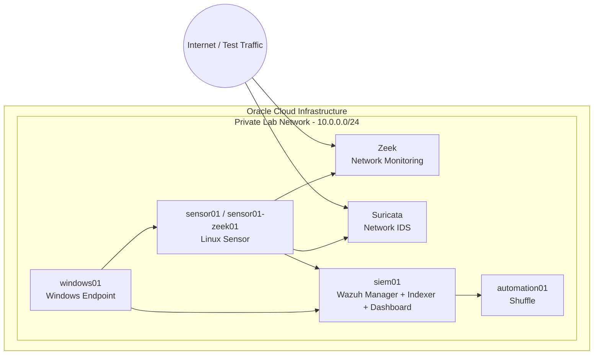

# Cloud SOC & SIEM Lab

A multi-host Security Operations Center (SOC) and SIEM lab built on Oracle Cloud Infrastructure (OCI) using Wazuh, Suricata, Zeek, Linux, Windows and Shuffle.

> **Project type:** Educational / portfolio cybersecurity lab  
> **Environment:** Oracle Cloud Infrastructure  
> **Private lab network:** `10.0.0.0/24`

## Overview

This project demonstrates how security telemetry can be collected from multiple hosts, analyzed centrally, investigated through network and endpoint evidence, and connected to security automation workflows.

The lab combines:

- **Wazuh** — SIEM, endpoint monitoring and centralized security analysis
- **Suricata** — network IDS/NSM and protocol/alert telemetry
- **Zeek** — network security monitoring and connection metadata
- **Shuffle** — security workflow automation
- **Linux and Windows** — monitored endpoints/systems
- **Oracle Cloud Infrastructure** — cloud-hosted lab infrastructure
- **SSH** — remote administration and operational management

## Architecture



## Hosts

| Host | Role |
|---|---|
| `siem01` | Wazuh Manager, Indexer and Dashboard |
| `sensor01` / `sensor01-zeek01` | Linux security and network sensor |
| `windows01` | Windows monitored endpoint |
| `automation01` | Shuffle automation server |

## Telemetry Flow

1. Endpoint and network activity is generated inside the controlled lab.
2. The Linux sensor observes network traffic.
3. Suricata produces structured IDS/NSM events in `eve.json`.
4. Zeek produces network metadata such as `conn.log`.
5. Wazuh agents forward endpoint/security telemetry to the Wazuh server.
6. Wazuh centralizes and visualizes security events.
7. Shuffle can receive events through webhooks and execute response workflows.

## Evidence From the Completed Lab

The completed lab demonstrated:

- Successful Wazuh agent connectivity.
- Suricata packet capture and protocol analysis.
- TCP, UDP, DNS, HTTP, TLS and SSH traffic visibility.
- **49,691 Suricata rules loaded** during testing.
- **59 Suricata alerts recorded** during a captured test run.
- Zeek network connection telemetry through `conn.log`.
- Windows endpoint activity generating security telemetry.
- SSH-based administration of cloud hosts.
- Shuffle webhook/workflow integration.

These figures describe the recorded lab run and are not claims about production-scale performance.

## Repository Structure

```text
cloud-soc-siem-lab/
├── README.md
├── LICENSE
├── .gitignore
├── docs/
│   ├── architecture.md
│   ├── deployment-guide.md
│   ├── detection-and-monitoring.md
│   ├── incident-investigation.md
│   └── automation.md
├── architecture/
│   └── topology.md
├── wazuh/
│   └── README.md
├── suricata/
│   └── README.md
├── zeek/
│   └── README.md
├── shuffle/
│   └── README.md
├── scripts/
│   ├── linux/
│   └── windows/
├── evidence/
│   ├── wazuh/
│   ├── suricata/
│   ├── zeek/
│   └── network/
└── screenshots/
    ├── architecture/
    ├── wazuh/
    ├── suricata/
    ├── zeek/
    └── shuffle/
```

## Security and Privacy

Never commit:

- OCI API keys
- SSH private keys
- Wazuh credentials
- Shuffle credentials or tokens
- Webhook secrets
- Private hostnames that should remain confidential
- Unredacted production logs
- Personal data

Use sanitized examples and placeholders when documenting configuration.

## Scope

This is a controlled educational environment. It is designed to demonstrate SOC concepts, telemetry collection, detection, investigation and automation. It is **not presented as a production-ready SOC deployment**.

## Learning Outcomes

This project demonstrates practical exposure to:

- SIEM architecture
- Endpoint telemetry
- Network security monitoring
- IDS alert analysis
- Log collection and normalization
- Cloud-hosted security infrastructure
- Linux administration
- Windows security monitoring
- Security investigation
- Security automation
- SOC architecture and documentation

## Future Improvements

- Add centralized threat-intelligence enrichment.
- Add custom Wazuh detection rules.
- Add additional Windows event collection.
- Build repeatable infrastructure deployment.
- Add automated incident enrichment and notification.
- Add dashboards for security KPIs.
- Add documented detection test cases.
