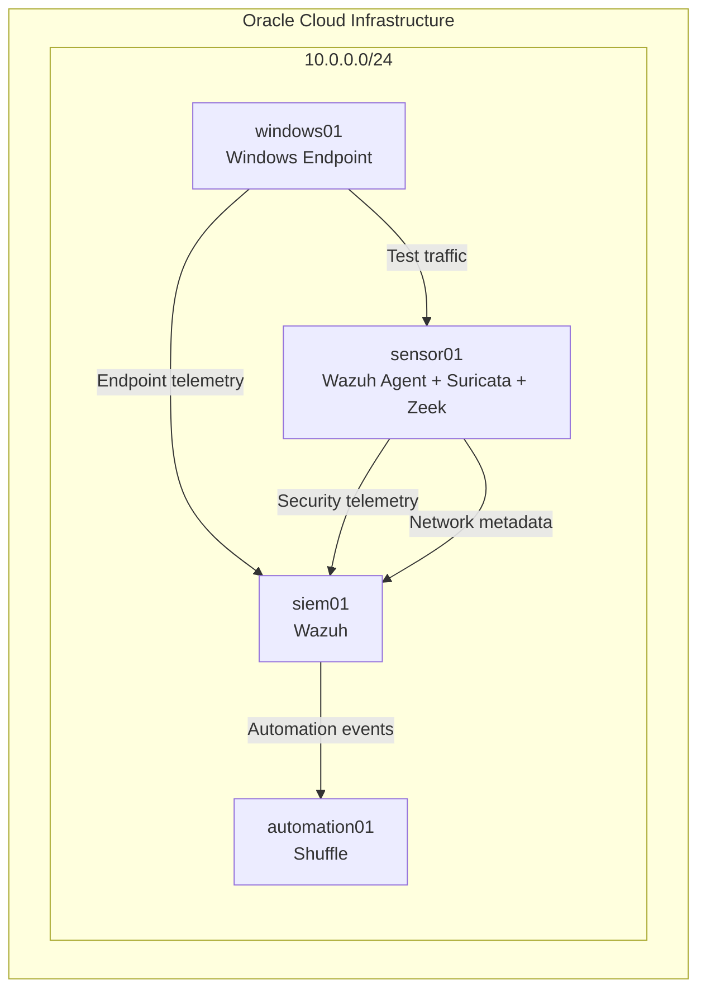

# Network Topology

## Lab Network

The completed environment used a private:

`10.0.0.0/24`

network.

## Logical Topology

## Host Roles

| Host | Primary Role |
|---|---|
| siem01 | Central SIEM |
| sensor01 / sensor01-zeek01 | Network security sensor |
| windows01 | Endpoint telemetry |
| automation01 | Security automation |

Keep exact public IP addresses and cloud-specific identifiers out of public documentation.
